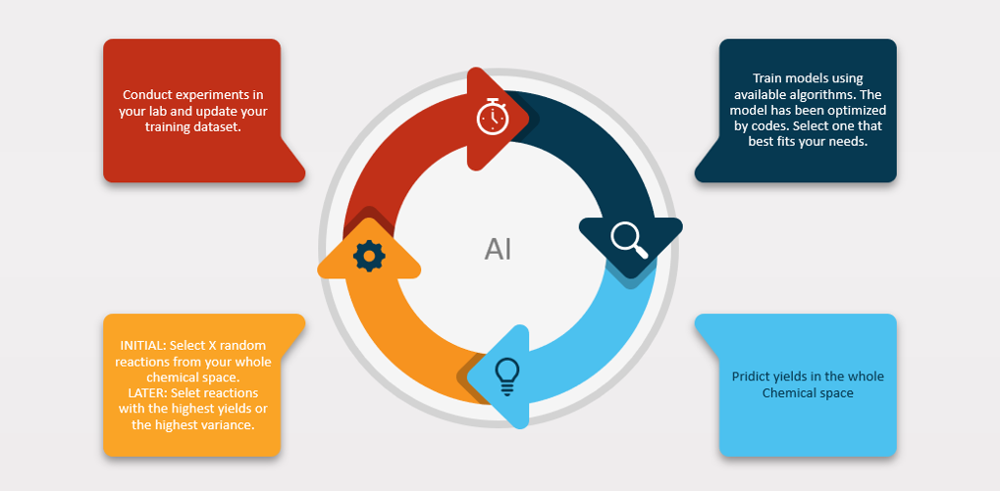
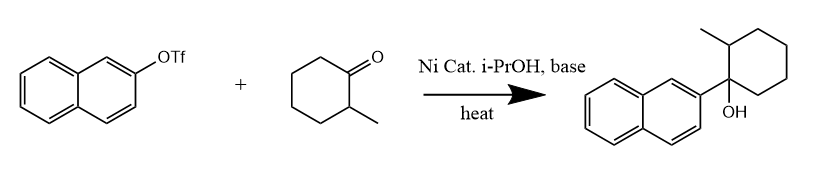

# OrganicChem-LabMate-AI

This repository contains codes for YangZhang's OrganicChem-LabMate-AI project. Here is the original literature [LabMate-AI]( https://chemrxiv.org/articles/Evolving_and_Nano_Data_Enabled_Machine_Intelligence_for_Chemical_Reaction_Optimization/7291205 "Evolving and Nano Data Enabled Machine Intelligence for Chemical Reaction Optimization") by  Daniel Reker, Gonçalo Bernardes, Tiago Rodrigues. I modified the codes in Jupyter Notebook using different algorithms, like [SVM]( https://scikit-learn.org/stable/modules/svm.html#svm-classification "SVM User Guide"), [K-NN]( https://scikit-learn.org/stable/modules/neighbors.html "K-NN User Guide"), [Linear regression]( https://scikit-learn.org/stable/modules/linear_model.html "Linear regression User Guide" ). Original codes is available as well.

Here is the reaction that I want to optimize.

## Current available algorithms

- SVM
- K-NN
- Linear Regression
- Random forest

## Dependencies

The codes depend on the following packages:

- [Pandas](https://pandas.pydata.org)
- [Numpy]( https://numpy.org/ )
- [scikit-learn](http://scikit-learn.org/stable/)
- [seaborn]( https://seaborn.pydata.org/ )
- [matplotlib]( https://matplotlib.org/ )
- [treeinterpreter]( https://github.com/andosa/treeinterpreter )

## About the folders

### -> continuous-variables

File folder '**continuous -variable**' contains modified codes in different algorithms as well as the original one. The data **only** contains **continues** variables, i.e. the input are only **numerical**. This code  works only when your reagents are set, which means you should control the range of your input, e.g. the moles of your reagent, catalysts, the temperature and the solvents. 

### -> discrete-variables

Since discrete variables are much more valuable than continuous in organic chemistry, my second stage work focused on using incorporating discrete variables. The method I use is one hot encoding. The dataset is available from supplementary material of this [literature]( https://science.sciencemag.org/content/359/6374/429  " A platform for automated nanomole-scale reaction screening and micromole-scale synthesis in flow ").

**Note**: Codes with 'greedy' means the results are ranked by highest predictions. Code with 'balanced' means the results are ranked by highest variance.

## Useful links:

[LabMate-AI]( https://chemrxiv.org/articles/Evolving_and_Nano_Data_Enabled_Machine_Intelligence_for_Chemical_Reaction_Optimization/7291205 )

[A platform for automated nanomole-scale reaction screening and micromole-scale synthesis in flow]( https://science.sciencemag.org/content/359/6374/429)

## Datasets:

[Original codes and Data in LabMate-AI]( https://github.com/YANGZ001/OrganicChem-LabMate-AI/tree/master/continuous-variables/literature-code-in-python/Manuscript )

[Data in A platform for automated nanomole-scale reaction screening and micromole-scale synthesis in flow]( https://github.com/YANGZ001/OrganicChem-LabMate-AI/blob/master/discrete-variables/5760_simple_discriptors.xlsx )

## Acknowledgement:

Thanks to my former supervisor Doc. **[Stephen G. Newman]( https://www.newmanlab.ca/ "The newman lab")** and my co-worker **Eric. Isbrandt** and also all the people from [Newman's lab]( https://www.newmanlab.ca/lab-members "Lab members"). 

## Contributors:

[Yang Zhang]( https://yangz001.github.io/ )

Email: zyfunnyyoung@gmail.com

## License

This project is released under the MIT License. Please refer to the [this page](https://github.com/YANGZ001/OrganicChem-LabMate-AI/blob/master/LICENSE) for more information. 

Please note that OrganicChem-LabMate-AI is still in experimental development. We continuously strive to improve its functionality and performance, but at this stage we cannot guarantee the reproducibility of any results published in papers. Use the codes at your own risk.