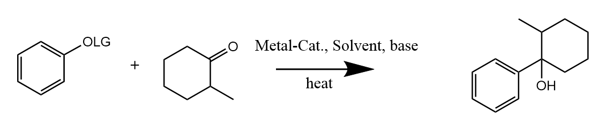

# OrganicChem-LabMate-AI

## Background

This repository contains codes for YangZhang's OrganicChem-LabMate-AI project. Here is the original literature [LabMate-AI]( https://chemrxiv.org/articles/Evolving_and_Nano_Data_Enabled_Machine_Intelligence_for_Chemical_Reaction_Optimization/7291205 "Evolving and Nano Data Enabled Machine Intelligence for Chemical Reaction Optimization") by  Daniel Reker, Gonçalo Bernardes, Tiago Rodrigues. I modified the codes in Jupyter Notebook using different algorithms, like [SVM]( https://scikit-learn.org/stable/modules/svm.html#svm-classification "SVM User Guide"), [K-NN]( https://scikit-learn.org/stable/modules/neighbors.html "K-NN User Guide"), [Linear regression]( https://scikit-learn.org/stable/modules/linear_model.html "Linear regression User Guide" ). Original codes is available as well.

Here is the reaction that I want to optimize.

## About the folders

### -> continuous-variables 

File folder '**continuous -variable**' contains modified codes in different algorithms as well as the original one. The data **only** contains **continues** variables, i.e. the input are only **numerical**. This code  works only when your reagents are set, which means you should control the range of your input, e.g. the moles of your reagent, catalysts, the temperature and the solvents. 

### -> discrete-variables

Since discrete variables are much more valuable than continuous in organic chemistry, my second stage work focused on using incorporating discrete variables. The method I use is one hot encoding. The dataset is available from supplementary material of this [literature]( https://science.sciencemag.org/content/359/6374/429  " A platform for automated nanomole-scale reaction screening and micromole-scale synthesis in flow ").

**Note**: Codes with 'greedy' means the results are ranked by highest predictions. Code with 'balanced' means the results are ranked by highest variance.

## Acknowledgement:

Thanks to my former supervisor Doc. **[Stephen G. Newman]( https://www.newmanlab.ca/ "The newman lab")** and my co-worker **Eric. Isbrandt** and also all the people from [Newman's lab]( https://www.newmanlab.ca/lab-members "Lab members"). 